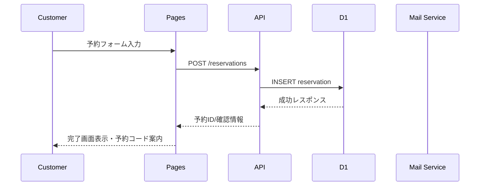
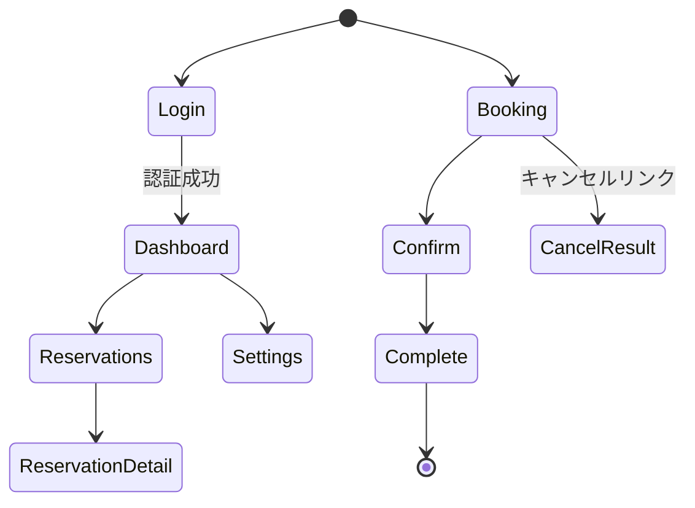

# 基本設計書: 予約管理サービス

## 1. 概要
### 1.1 文書の目的
本書は個人経営店舗向けオンライン予約管理サービスの基本設計を示し、関係者間でシステム構成・機能・非機能要件に関する共通理解を形成することを目的とする。

### 1.2 システム全体像
店舗オーナーと顧客がWebブラウザ経由でアクセスし、Cloudflare Pages 上のフロントエンドと Hono ベースのサーバレスAPIで予約データを管理する。データはCloudflare D1（SQLite互換）に保存し、MVPではメール送信を伴う機能は実装しない。

### 1.3 前提条件・制約
- 対象は単一店舗・単一オーナー。
- リリースはCloudflare Pages + Functions 環境。
- 開発言語はTypeScript、モジュール形式はESM。
- ネットワーク越しのデータ通信はすべてHTTPS。

## 2. システム構成
### 2.1 システム構成図
```mermaid
graph LR
  subgraph Client
    Owner[店舗オーナーのブラウザ]
    Customer[顧客のブラウザ]
  end
  subgraph Cloudflare
    Pages[Cloudflare Pages (React/Vite)]
    Functions[Cloudflare Functions (Hono API)]
    D1[(Cloudflare D1)]
  end
  Owner -->|HTTPS| Pages
  Customer -->|HTTPS| Pages
  Pages --> Functions
  Functions --> D1
```

### 2.2 構成要素の説明
- クライアント: PC/スマートフォンブラウザ。予約閲覧・管理操作を行う。
- Cloudflare Pages: React + Vite で構築したSPA。APIと連携してUIを提供。
- Cloudflare Functions (Hono): 予約CRUD、認証、通知処理を担う。
- Cloudflare D1: 予約・顧客・設定データを保持するリレーショナルデータベース。

### 2.3 ネットワーク構成
- クライアントからのアクセスはCloudflareのエッジに終端しHTTPSで保護。
- Cloudflare内でPagesとFunctions間は内部ネットワークで通信。
- Functions から D1 はCloudflareの安全な接続を利用。

## 3. アーキテクチャ設計
### 3.1 技術スタック
- フロントエンド: React 18, Vite 5, TypeScript, Tailwind CSS（想定）。
- バックエンド: Hono 4 on Cloudflare Functions。
- データベース: Cloudflare D1。
- インフラ/運用: Cloudflare Pages, Wrangler CLI, GitHub Actions（将来的なCI想定）。

### 3.2 コンポーネント構成図
```mermaid
graph TB
  UI[UI レイヤー
  (React Components)]
  Store[状態管理
  (React Hooks/Context)]
  Service[サービス層
  (APIクライアント, 認証)]
  API[Hono ルーター]
  Controller[リクエストハンドラ]
  Repository[Repository
  (D1アクセス)]
  UI --> Store --> Service --> API --> Controller --> Repository
```

### 3.3 データフロー図


### 3.4 外部サービス利用方針
- 外部サービス: MVPでは利用しない（今後の通知・決済連携は拡張で検討）。
- 分析/ログ監視: Cloudflare Analytics と Wrangler のログコマンドを活用。

## 4. 機能設計
### 4.1 機能一覧
- 予約枠設定管理、予約一覧表示、予約CRUD。
- 顧客向け予約検索・登録・キャンセル。
- オーナー向けダッシュボード（当日・今後の予約表示）。

### 4.2 各機能の入出力・処理フロー
- オーナー予約一覧: 入力=リクエスト（期間フィルタ）、出力=予約リスト。
- 予約登録（顧客）: 入力=日時/顧客情報、出力=予約ID/確認情報、処理=枠空き確認→登録。
- 予約キャンセル: 入力=予約ID+トークン、処理=更新。

### 4.3 権限制御（ユーザー／管理者）
- 店舗オーナーのみ管理機能へアクセス。セッション/トークンによる認証。
- 顧客は公開API（予約作成/キャンセル）にのみアクセス。

### 4.4 エラーハンドリング方針
- クライアント向け: ステータスコードとユーザーフレンドリーなメッセージ。
- API: 4xx（入力/認証エラー）、5xx（サーバエラー）。Cloudflareログに詳細を記録。

## 5. 画面設計
### 5.1 サイトマップ
- ルート: `/`
  - ダッシュボード `/dashboard`
  - 予約設定 `/settings`
  - 予約一覧 `/reservations`
  - 顧客予約ページ `/booking`
  - 予約完了 `/booking/complete`

### 5.2 画面一覧
- ログイン画面、ダッシュボード、予約一覧、予約詳細編集、設定画面、顧客予約フォーム、予約確認、完了画面、キャンセル結果画面。

### 5.3 画面遷移図


### 5.4 各画面のワイヤーフレーム
- ダッシュボード: 当日予約リスト、今後の予約カード、主要アクションボタン。
- 予約フォーム: カレンダー、時間枠リスト、入力フォーム（氏名・メール・電話・メモ）。
- 設定画面: 営業日・時間・枠長設定。

### 5.5 共通UIコンポーネント
- ヘッダー: ロゴ、ナビゲーション、ログアウト。
- フッター: コピーライト、問い合わせリンク。
- ダイアログ: 予約キャンセル確認、設定保存確認。
- トースト通知: 成功・失敗メッセージ。

## 6. 非機能設計（概要）
### 6.1 パフォーマンス要件
- 主要ページ初回表示3秒以内。
- 予約APIの95パーセンタイル応答1秒以内。

### 6.2 セキュリティ要件
- HTTPS通信必須、パスワードハッシュ化。
- CSRF/CSRFトークンを活用。
- 環境変数管理による秘密情報保護。

### 6.3 可用性・信頼性要件
- Cloudflare Pages運用時間帯99%以上。
- エラー監視はWranglerログを中心に実施。

### 6.4 運用・監視設計
- デプロイ: GitベースでWranglerを使用。
- 監視: Cloudflare Analytics、エラーログの定期確認。
- バックアップ: D1スナップショットを日次取得（Wranglerタスク想定）。

## 7. 将来拡張
### 7.1 AI機能拡張
- 予約データの分析に基づく混雑予測やリマインダー送信の自動化。

### 7.2 多言語対応
- i18nライブラリ導入による多言語UI化。

### 7.3 モバイルアプリ連携
- APIを活用したハイブリッド/ネイティブアプリからの予約操作。
