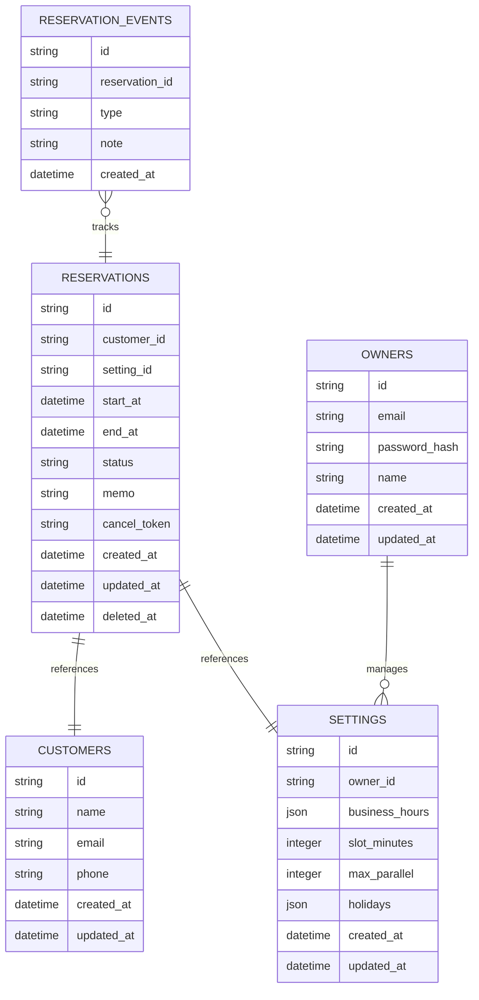

# データベース設計書: 予約管理サービス

## 1. 概要
### 1.1 データベース選定理由
Cloudflare D1 (SQLite互換) を採用する。理由はCloudflare Pages/Functionsと統合され、スケール要件がMVP範囲であり管理コストが低い点。

### 1.2 設計方針
- 正規化を基礎としつつ、読み取り性能を優先。
- 全ての日時はUTCで保存し、表示時にローカルタイムへ変換。
- 削除は論理削除を基本とし、必要に応じて物理削除をバッチで実施。

### 1.3 命名規則
- テーブル名: 複数形スネークケース（例: `reservations`）。
- カラム名: スネークケース。
- 主キー: `id` (UUID)。

## 2. 論理設計
### 2.1 ER図

### 2.2 テーブル一覧
- `owners`: 店舗オーナー認証情報。
- `settings`: 営業設定。
- `customers`: 顧客基本情報。
- `reservations`: 予約情報。
- `reservation_events`: 予約の履歴イベント（ステータス遷移）。

### 2.3 正規化レベル
- 第3正規形を基本とし、履歴管理のため一部冗長化を許容。

## 3. 物理設計
### 3.1 テーブル定義（抜粋）
| テーブル | 主キー | 備考 |
| --- | --- | --- |
| owners | id | 単一オーナーだが拡張性のためテーブル化 |
| settings | id | owner_idでownersに紐づく |
| customers | id | メール/電話はユニーク制約を検討 |
| reservations | id | 状態・期間などを保持 |
| reservation_events | id | 予約状態の履歴、予約IDに外部キー |

### 3.2 カラム詳細（例: reservations）
| カラム名 | 型 | NULL | 説明 |
| --- | --- | --- | --- |
| id | TEXT | NOT NULL | UUID |
| customer_id | TEXT | NOT NULL | 顧客ID |
| setting_id | TEXT | NOT NULL | 設定ID |
| start_at | TEXT | NOT NULL | 予約開始日時 (ISO8601) |
| end_at | TEXT | NOT NULL | 予約終了日時 |
| status | TEXT | NOT NULL | `booked/cancelled` 等 |
| memo | TEXT | NULL | 任意メモ |
| cancel_token | TEXT | NOT NULL | 自己キャンセル用トークン |
| created_at | TEXT | NOT NULL | 作成日時 |
| updated_at | TEXT | NOT NULL | 更新日時 |
| deleted_at | TEXT | NULL | 論理削除日時 |

### 3.3 インデックス設計
- `reservations`: `start_at`, `status`, `customer_id` に複合インデックス。
- `customers`: `email`, `phone` にユニークインデックス。
- `reservation_events`: `reservation_id`, `created_at`。

## 4. 運用設計
### 4.1 バックアップ方針
- Wranglerスクリプトで日次スナップショット取得。
- 週次で外部ストレージにアーカイブ。

### 4.2 マイグレーション戦略
- Wrangler の D1 マイグレーション機能を使用。
- バージョン管理されたSQLファイルを適用。

### 4.3 パフォーマンスチューニング
- 読み取りが多い予約一覧は期間指定を必須としインデックス活用。
- 大量キャンセルイベントはバッチ圧縮。

## 5. データ整合性
### 5.1 制約定義
- 外部キー制約で参照整合性確保。
- ステータス値はチェック制約で限定。

### 5.2 トランザクション管理
- 予約作成・更新は単一トランザクションで顧客作成 + 予約登録 + イベント記録。
- Cloudflare D1のACIDトランザクションを利用。
