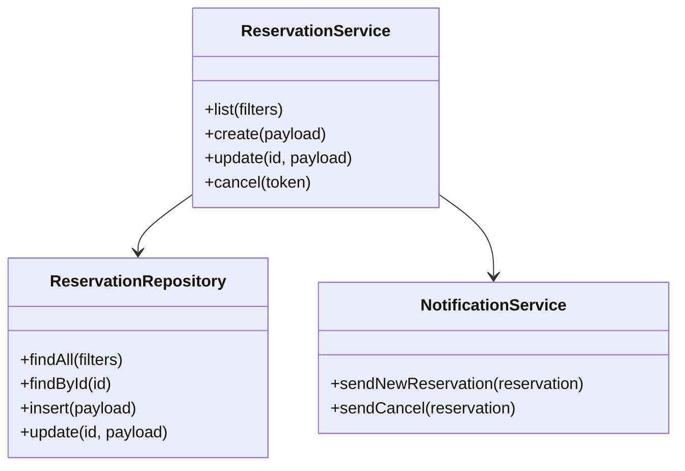

# 詳細設計書: 予約管理サービス

## 1. アーキテクチャ詳細
### 1.1 システム構成図（詳細版）
```mermaid
graph TD
  OwnerBrowser[店舗オーナー
  ブラウザ]
  CustomerBrowser[顧客ブラウザ]
  CDN[Cloudflare CDN/SSL]
  Pages[Cloudflare Pages
  (React SPA)]
  Functions[Cloudflare Functions
  (Hono API)]
  D1[(Cloudflare D1)]

  OwnerBrowser --> CDN --> Pages
  CustomerBrowser --> CDN --> Pages
  Pages --> Functions
  Functions --> D1
```

### 1.2 レイヤー構成
- プレゼンテーション層: Reactコンポーネント、ルーティング、フォーム。
- アプリケーション層: 状態管理、サービスクラス、APIクライアント。
- ドメイン層: 予約・顧客・設定のビジネスロジック。
- インフラ層: Honoルート、リポジトリ、D1アクセス。

### 1.3 モジュール分割
- `src/pages`: ページコンポーネント。
- `src/components`: UIコンポーネント。
- `src/hooks`: 状態管理用フック。
- `src/services`: APIクライアント、認証サービス。
- `src/server/routes`: Honoルート定義。
- `src/server/repositories`: D1アクセスラッパー。
- `src/server/usecases`: ビジネスロジック。

### 1.4 クラス図


## 2. アプリケーション設計
### 2.1 処理フロー
1. 店舗オーナーがログイン画面で資格情報を送信。
2. Hono API が認証し、セッショントークンを付与。
3. 予約一覧表示時にAPIへGETし、D1からデータ取得。
4. 顧客が予約フォーム送信→APIが枠を確認→登録。

### 2.2 API仕様概要
- 認証API: `/api/auth/login`, `/api/auth/logout`。
- 予約API: `/api/reservations` (GET/POST)、`/api/reservations/:id` (PATCH/DELETE)。
- 設定API: `/api/settings` (GET/PUT)。
- 顧客キャンセルAPI: `/api/public/reservations/:token/cancel` (POST)。

### 2.3 入出力インターフェース
- 入力: JSON（UTF-8）。
- 出力: JSON、HTTPステータスコードとメッセージ。
- 認証: HTTP Only Cookie または Bearer Token。

### 2.4 エラーハンドリング
- クライアントリクエストエラー: 400/401/403。
- リソース未検出: 404。
- サーバ内部エラー: 500。
- すべてのエラーは `requestId` を付与しログに記録。

## 3. データベース設計
### 3.1 `docs/db-design.md` を参照

## 4. セキュリティ設計
### 4.1 `docs/security-design.md` を参照

## 5. 非機能設計（詳細）
### 5.1 パフォーマンス要件
- API応答をキャッシュ可能なGETリクエストはEdge Cache（TTL 60秒）を検討。
- 重い処理が発生する場合はジョブの導入を検討（MVPでは対象なし）。

### 5.2 可用性・冗長化設計
- Cloudflareエッジ冗長性を活用。
- D1バックアップスナップショットを日次取得。

### 5.3 ログ・監視設計
- Wrangler tailでリアルタイム監視。
- 予約作成・キャンセルのイベントログをアプリ側でJSON出力。
- 異常検知時はWranglerログとアラートダッシュボードで確認。
